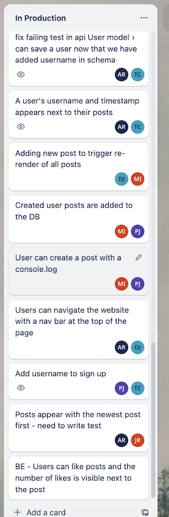

# Farcebook

 [Quick Start](#quick-start) | [Architecture](#architecture) | [Authentication](#authentication) | [Card wall](#card-wall) | [Installing](#installing-and-running-the-application) | [Testing](#testing) | [Screenshots](#screenshots)

Makers Academy's second engineering project - A FaceBook clone.

<p align="left">
    
    
    
    
    
    
    
    
    
    
    
 </p>

## The Brief

The second of our team Engineering Projects as part of the Makers Academy software development bootcamp, over two weeks our team of 5 was tasked with understanding a [pre existing codebase](https://github.com/makersacademy/acebook-mern-template), using the MERN stack. MongoDB, React, Express and Cypress were all brand new technologies to us at the start of this project, and much of the time and energy over the two weeks went into learning these, and how they had been put into practice in the existing codebase.

From the Makers Academy brief:

>In this project, you are tasked with working on an existing application. A significant part of the challenge will be to familiarise yourself with the codebase you've inherited, as you work to **improve and extend** it.

## Quick Start

This assumes that you have Node.js and MongoDB installed on your machine. If not, see the [Installing and Running the Application](#installing-and-running-the-application) section below.

1. Clone this repository to your local machine.
2. Start the MongoDB server, `mongod`.
**Note:** If you see a message that says `If you need to have mongodb-community@6.0 first in your PATH, run:`, follow the instruction. Restart your terminal after this.
**Note:** If the server will not start, you may need to run `brew services start mongodb-community@6.0` in a new terminal window.
3. ONLY if you wish to run tests, create the MongoDB test database and its collections (the main 'acebook' DB will be created automatically when the application is used):
```
mongosh
use acebook_test
db.createCollection("users")
db.createCollection("posts")
```
4. You will need two terminal windows open, one for the frontend and one for the backend.
5. For the backend:
```
# from the root directory of the project
cd api
# to install dependencies
npm install
# to start the backend server
JWT_SECRET=SUPER_SECRET npm start
```
6. For the frontend:
```
# from the root directory of the project
cd frontend
# to install dependencies
npm install
# to start the frontend server
npm start
```
7. Your browser should open the project at `http://localhost:3000/`.

## Architecture

[Top](#farcebook) | [The Brief](#the-brief) | [Quick Start](#quick-start) | [Authentication](#authentication) | [Card wall](#card-wall) | [Installing](#installing-and-running-the-application) | [Testing](#testing) | [Screenshots](#screenshots)

This application is comprised of two distinct pieces.

- A backend API built with Express
- A front end built with React

The React front end sends HTTP requests to the backend API and receives JSON in response body, rather than a whole page of HTML.

Currently, user password are stored in the DB in plaintext. In a real world implementation of this application, we would of course have used a hashing alogirithm for this (a ticket we did not get time to implement during the project).

## Authentication

The application uses JSON Web Tokens for authentication.

Here, we've used an environment variable called `JWT_SECRET`, which you'll see used in the commands to start the application and run the tests (below). You can change the value of that environment variable to anything you like.

## Card wall

Our team trello board shows the tickets we worked through, and what was still in our backlog at the end of the final sprint.


|Team trello board 2|Team trello board 3|
|:-:|:-:|
|||


## Installing and running the application

[Top](#farcebook) | [The Brief](#the-brief) | [Quick Start](#quick-start) | [Architecture](#architecture) | [Authentication](#authentication) | [Card wall](#card-wall) | [Installing](#installing-and-running-the-application) | [Testing](#testing) | [Screenshots](#screenshots)

#### Install Node.js

For Mac:
1. Install Node Version Manager (NVM)
   ```
   brew install nvm
   ```
   Then follow the instructions to update your `~/.bash_profile`.
2. Open a new terminal
3. Install the latest version of [Node.js](https://nodejs.org/en/), currently `18.1.0`.
   ```
   nvm install 18
   ```
For other operating systems, see the [Node.js website](https://nodejs.org/en/).

#### Set up the database

1. Install MongoDB:
```
brew tap mongodb/brew
brew install mongodb-community@6.0
```
**Note:** If you see a message that says `If you need to have mongodb-community@6.0 first in your PATH, run:`, follow the instruction. Restart your terminal after this.
2. Start MongoDB
```
brew services start mongodb-community@6.0
```
3. Create the MongoDB test database and its collections (the main 'acebook' DB will be created automatically when the application is used):
```
mongosh
use acebook_test
db.createCollection("users")
db.createCollection("posts")
```

#### Clone the repository, install dependencies and start the application
1. Clone this repository to your local machine.
2. cd into the project directory. You will need two terminal windows open, one for the frontend and one for the backend.
3. For the backend:
**Note the use of an environment variable for the JWT secret**
```
# from the root directory of the project
cd api
# to install dependencies
npm install
# to start the backend server
JWT_SECRET=SUPER_SECRET npm start
```
4. For the frontend:
```
# from the root directory of the project
cd frontend
# to install dependencies
npm install
# to start the frontend server
npm start
```
5. Your browser should open the project at `http://localhost:3000/`.

You may register as a new user with an optional avatar and then log in.

After logging in, you'll be able to create posts, like and comment.

## Testing

[Top](#farcebook) | [The Brief](#the-brief) | [Quick Start](#quick-start) | [Architecture](#architecture) | [Authentication](#authentication) | [Card wall](#card-wall) | [Installing](#installing-and-running-the-application) | [Screenshots](#screenshots)

#### Testing the Backend (API)

**Note the use of an environment variable for the JWT secret**

Start the server in test mode (so that it connects to the test DB)
```
cd api
JWT_SECRET=SUPER_SECRET npm run start:test
```

Then run the tests in a new terminal session:
```
cd api
JWT_SECRET=SUPER_SECRET npm run test
```

#### The frontend (React)

**Note the use of an environment variable for the JWT secret**

Start the backend server in test mode **as per above**

Set the environment variable that allows Cypress to conect to your MongoDB instance running locally by copying the address of the server on which MongoDB is running e.g. 'mongodb://localhost:27017', and running the command `export MONGO_URI=[your_mongoDB_server_address]` (without the square brackets)

Then start the front end in a second terminal session:
```
cd frontend
JWT_SECRET=SUPER_SECRET npm start
```

Then, to run all Cypress tests in a new terminal session:
```
cd frontend
JWT_SECRET=SUPER_SECRET npm run test
```

To run only the Cypress component tests:
```
cd frontend
JWT_SECRET=SUPER_SECRET npm run test:unit
```

To run only the Cypress end to end tests:
```
cd frontend
JWT_SECRET=SUPER_SECRET npm run test:feature
```

## Screenshots

[Top](#farcebook) | [The Brief](#the-brief) | [Quick Start](#quick-start) | [Architecture](#architecture) | [Authentication](#authentication) | [Card wall](#card-wall) | [Installing](#installing-and-running-the-application) | [Testing](#testing)

Register a new user:


Log in:


main page with posts:


Create a post:


View the added post:


Make a comment:


View the comment:


[Top](#farcebook) | [The Brief](#the-brief) | [Quick Start](#quick-start) | [Architecture](#architecture) | [Authentication](#authentication) | [Card wall](#card-wall) | [Installing](#installing) | [Testing](#testing)